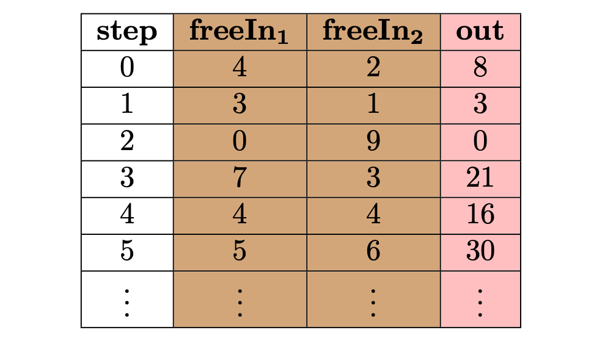
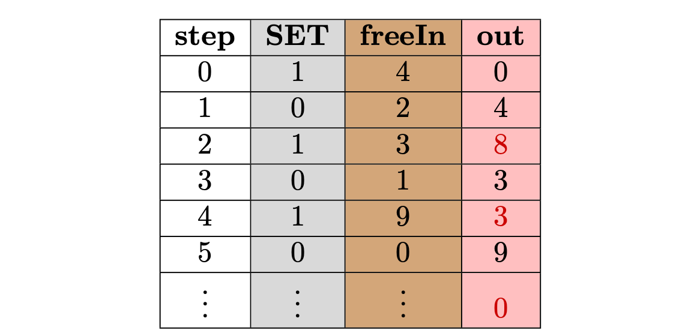
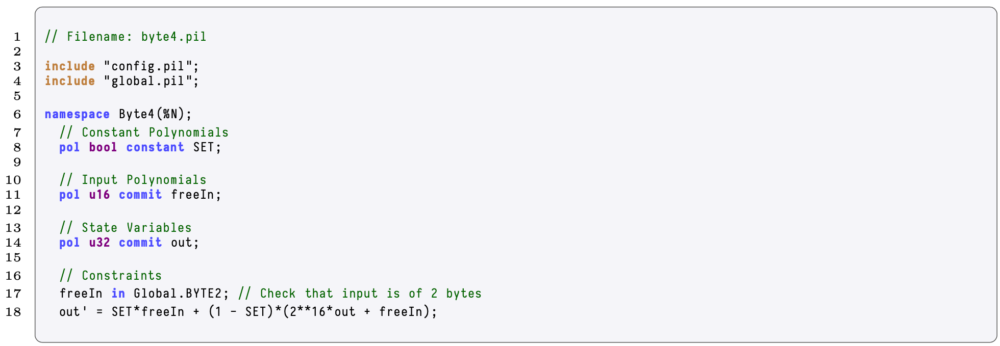

# **Beginner Examples**
## **State Machine that Multiplies Two Numbers**

Consider a state machine that takes two input numbers $x$ and $y$, and multiplies them. Hence call the state machine, the _Multiplier_ state machine, described by the function;

$$
f(x,y) = x \cdot y.
$$

The table below shows the computational trace on various inputs.

As it can be observed, the input to this computation is fed into the two _free input_ polynomials, $\texttt{freeIn}_1$ and $\texttt{freeIn}_2$, and the output of this computation is set to the _output_ polynomial $\texttt{out}$, which contains the product of the free input polynomials.

The nature of the previous polynomials suggests the following classification:

- $\textbf{Free Input Polynomials}$. These are polynomials which are in charge of introducing the various inputs to the computation.They are referred to as "free" because at every clocking of the computation their values do not strictly depend on any previous iteration. These are analogous to independent variables of the entire computation.
- $\textbf{State Variables}$. These are the polynomials that compose the _state_ of the state machine. Here state refers to the set of values that represent the output of the state machine at each step and, if we are in the last step, the output of the entire computation.

Below diagram provides an overview of this division.

In order to achieve correct behaviour of this state machine, one obvious constraint that must be satisfied is,

$$
\texttt{out} = \texttt{freeIn}_1 \cdot \texttt{freeIn}_2.
$$

In PIL, all the components (**polynomials and identities**) of this state machine are introduced as shown in the code snippet below:

The problem with this design is that the number of committed polynomials grows linearly with the number of multiplications; so that, if we would have to compute a huge number of (possibly distinct) operations, the number of free input polynomials would be unnecessarily big.

Reduction of the number of free input polynomials can be achieved by introducing _constant_ polynomials. These are preprocessed inputs to the state machine. That is, polynomials known prior to the execution of the computation and used as selectors, latches or sequencers, among other roles.

Below figure is an updated version of the diagram provided above. The difference between them is **addition of constants**.

The table below shows the computational trace for the optimized Multiplier state machine.

Now, the two inputs to this computation are sequentially fed into the _only_ free input polynomial $\texttt{freeIn}$. In the first step, the first input $x=4$ is moved from $\texttt{freeIn}$ to $\texttt{out}$. In the second step, $x$ is multiplied by the second input $y=2$, and the result is set to be in $\texttt{out}$.

In order to achieve the correctness of this new version, the previous constraint is changed so that the constant polynomial $\texttt{SET}$ helps in achieving the desired behavior:

$$
\texttt{out}' = \texttt{SET} \cdot \texttt{freeIn} + (1 - \texttt{SET}) \cdot (\texttt{out} \cdot \texttt{freeIn}).
$$

Notice how the $\texttt{SET}$ polynomial helps out with the branching. On the one hand, whenever $\texttt{SET}$ is set to $1$, then $\texttt{freeIn}$ is moved to the next value of $\texttt{out}$. While on the other hand, when $\texttt{SET}$ is set to $0$, then the stored value in $\texttt{out}$ is multiplied by the actual value of $\texttt{freeIn}$, which corresponds to the second input to the computation.

Note that as a convention, a tick $'$ (which is read "prime") is used to denote the "next" iteration.

In the case of polynomials defined over the roots of unity, this notation translates to,

$$
f'(X) := f(\omega X).
$$

In PIL, the optimized Multiplier is implemented as follows,

## **State Machine that Generates 4-Byte Numbers**

Now, let's consider building a state machine that takes two $2$-byte numbers and generates a $4$-byte number from them. Since the logic of this state machine is similar to the previous one, the number of polynomials (and its meaning) is also the same.

In the first step, the first input $x$ is moved from $\texttt{freeIn}$ to $\texttt{out}$. In a second step, $x$ is concatenated to the second input $y$ and set to be in $\texttt{out}$. Below table shows the computational trace for a Byte4 state machine.

For the purpose of displaying PIL's new features, the Byte4 state machine is built in a modular manner as illustrated next.

**First**, deploy the configuration file, called config.pil, which is typically used to include some configuration-related components, shared among various state machines.

In the example below, this configuration file will include the definition of a constant $N$ representing the upper bound for the number of rows to be used across various state machines.

**Second**, use the Global state machine. This state machine is used to store various polynomials representing "small" lookup tables, to be used by other state machines.

For instance, defining the Lagrange polynomial $L_1$ or the polynomial representing the set of $1$-byte numbers. As we have set this state machine to have size $N$, there are some polynomials that need to be accommodated in size.

**Third**, and finally, the Byte4 state machine is completed. Similar to the previous example, the constraint that needs to be satisfied is the following:

$$
\texttt{out}' = \texttt{SET} \cdot \texttt{freeIn} + (1 - \texttt{SET}) \cdot (2^{16} \cdot \texttt{out} + \texttt{freeIn}).
$$

Note how the product $2^{16} \cdot \texttt{out}$ forces the state machine to allocate the value from $\texttt{out}$ at the upper part of the result, while the addition of $\texttt{freeIn}$ allocates them at the lower part of the result.

This state machine is implemented in PIL as follows:

