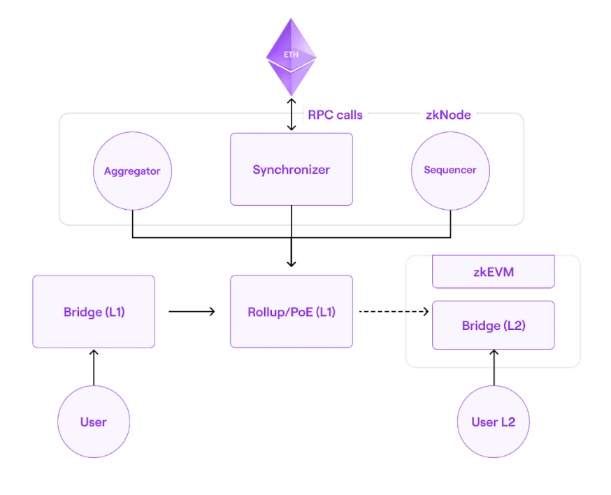
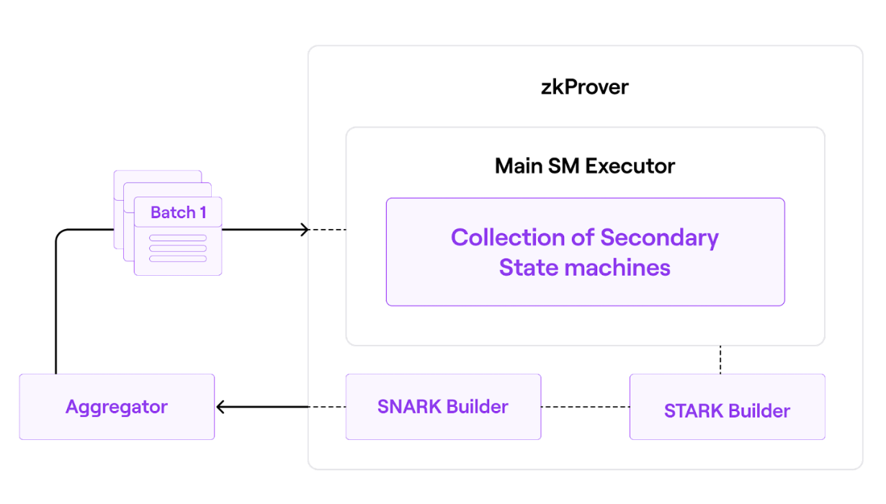

:::info

This documentation is still a **Work In Progress**. Some topics have been discussed in greater depth, while others require additional clarification.

If you are interested in learning about the basics of zero-knowledge, EVM, and other fundamental concepts behind Polygon zkEVM, check out the [<ins>Polygon zkEVM basics</ins>](/docs/home/polygon-basics/zkEVM-basics.md).

:::

Polygon zkEVM is a decentralized Ethereum Layer 2 scalability solution that uses cryptographic zero-knowledge proofs to offer validity and quick finality to off-chain transaction computation, also known as a **ZK-Rollup**.

The ZK-Rollup executes smart contracts transparently, by publishing zero-knowledge validity proofs, while maintaining opcode compatibility with the Ethereum Virtual Machine. This documentation provides an overview of the Polygon zkEVM.

## Overview

Polygon zkEVM handles state transitions caused by Ethereum Layer 2 transaction executions (transactions that users send to the network). Following that, it creates validity proofs that attest to the accuracy of these off-chain state change calculations by utilising zero-knowledge features.

The major components of zkEVM are:

- Proof of Efficiency (PoE) Consensus Mechanism
- zkNode
   - Synchronizer
   - Sequencers & Aggregators
   - RPC
- zkProver
- LX-to-LY Bridge

The skeletal architecture of Polygon zkEVM is shown below:

## [Proof of Efficiency (PoE)](proof-of-efficiency.md)

The earlier version, **Polygon Hermez 1.0**, was based on the **Proof of Donation (PoD)** consensus mechanism. PoD was basically a decentralized auction conducted automatically, with participants (coordinators) bidding a certain number of tokens in order to be chosen to create the next batch.

Our latest **Proof of Efficiency (PoE)** consensus mechanism leverages the experience of the existing **PoD** in v1.0 and add support for the permissionless participation of multiple coordinators to produce batches in L2.

Explore Proof of Efficiency in detail [here](proof-of-efficiency.md).

## [zkNode](zknode/overview.md)

zkNode is the software needed to run any zkEVM node. It is a client that the network requires to implement the Synchronization and govern the roles of the participants (Sequencers or Aggregators). Polygon zkEVM participants will choose how they participate:

- As a node to know the state of the network, or
- As a participant in the process of batch production in any of the two roles: **Sequencer** or **Aggregator**

The zkNode architecture is modular in nature. You can dig deeper into zkNode and its components [here](zknode/overview.md).

### Incentivization Structure

The two permissionless participants of the zkEVM network are: **Sequencers** and **Aggregators**. Proper incentive structures have been devised to keep the zkEVM network fast and secure. Below is a summary of the fee structure for Sequencers and Aggregators:
- **Sequencer**
   - Collect transactions and publish them in a batch
   - Receive fees from the published transactions
   - Pay L1 transaction fees + MATIC (depends on pending batches)
   - MATIC goes to Aggregators
   - Profitable if: `txs fees` > `L1 call` + `MATIC` fee
- **Aggregator**
   - Process transactions published by Sequencers
   - Build zkProof
   - Receive MATIC from Sequencer
   - Static Cost: L1 call cost + Server cost (to build a proof)
   - Profitable if: `MATIC fee` > `L1 call` + `Server cost`

## [zkProver](/docs/zkEVM/architecture/zkProver)

zkEVM employs advanced zero-knowledge technology to create validity proofs. It uses a **zero-knowledge prover (zkProver)**, which is intended to run on any server and is being engineered to be compatible with most consumer hardware. Every **Aggregator** will use this zkProver to validate batches and provide Validity Proofs.

It consists of a **Main State Machine Executor**, a collection of **secondary State Machines** (each with its own executor), a **STARK-proof builder**, and a **SNARK-proof builder**.

In a nutshell, **the zkEVM expresses state changes in a polynomial form**. As a result, the constraints that each proposed batch must meet are polynomial constraints or polynomial identities. To put it another way, all valid batches must satisfy specific polynomial constraints. Check out the detailed architecture of zkProver [here](/docs/zkEVM/architecture/zkProver).

## [The LX-to-LY Bridge](lx-ly-bridge.md)

An **LX-LY bridge** is a Smart Contract that lets users transfer their assets between two layers, LX and LY. The L1-L2 in zkEVM is a decentralised bridge for secure deposits and withdrawal of assets. It is a combination of two smart contracts, one deployed on one chain and the second on the other.

The L1 and L2 contracts in zkEVM are identical except for where each is deployed. **Bridge L1 Contract** is on the Ethereum mainnet in order to manage asset transfers between rollups, while **Bridge L2 Contract** is on a specific rollup and it is responsible for asset transfers between Mainnet and the Rollup (or Rollups).

Layer 2 interoperability allows a native mechanism to migrate assets between different L2 networks. This solution is embedded in the bridge smart contract.

## Verifier

Verifier is a Smart Contract which is able to verify any ZK-SNARK cryptographic proof. This SNARK Verifier proves the validity of every transaction in the batch. It is the key entity in any zk-Rollup architechture for the prime reason that it verifies the correctness of a Proof ensuring a valid state transition.

## Transaction Life Cycle

Before getting into a transaction flow in L2, users need some funds to perform any L2 transaction. In order to do so, users need to transfer some ether from L1 to L2 through the zkEVM Bridge dApp.

- **Bridge**
   - Deposit ether
   - Wait until `globalExitRoot` is posted on L2
   - Perform claim on L2 and receive the funds

- **L2 Transactions**
   - User initiates tx in a Wallet (e.g. Metamask) and sends it to a Sequencer
   - It gets finalized on L2 once Sequencer commits to add his transaction
   - Transaction has finalized on L2, but not on L1 (simply put, L2 state is not yet on L1). Also known as **Trusted State**
   - Sequencer sends the batch data to L1 smart contract, enabling any node to synchronize from L1 in a trustless way (aka **Virtual State**)
   - Aggregator will take pending transactions to be verified and build a Proof in order to achieve finality on L1
   - Once the Proof is validated, user's transactions will attain L1 finality (important for withdrawals). This is called the **consolidated state**.

## Design Characteristics

We plan to create a network which is: permissionless, decentralized, secure, efficient, and comes with verifiable block data.

Development efforts aim at **permissionless-ness**, that is, allowing anyone with the zkEVM software to participate in the network. For instance, the consensus algorithm will give everyone the opportunity to be a Sequencer or an Aggregator.

Data availability is most crucial for **decentralization**, where every user has sufficient data needed to rebuild the full state of a rollup. As discussed above, the team still has to decide on the best configuration for data availability. The aim is to ensure that there is no censorship and that no one party can control the network.

zkEVM was designed with **security** in mind. And as an L2 solution, most of the security is inherited from Ethereum. Smart contracts will ensure that everyone who executes state changes does so appropriately, creates a proof that attests to the validity of a state change, and makes validity proofs available on-chain for verification.

## Efficiency and Overall Strategy

Efficiency is key to network performance. zkEVM applies several implementation strategies to guarantee efficiency. A few of them are listed below:

1. The first strategy is to **deploy PoE**, which incentivizes the most efficient aggregators to participate in the proof generation process.

2. The second strategy is to **carry out all computations off-chain** while keeping only the necessary data and zk-proofs on-chain.

3. The way in which the bridge smart contract is implemented, such as settling accounts in a UTXO manner, by only using the Exit Tree Roots.

4. Utilisation of specialised cryptographic primitives within the zkProver in order to speed up computations and minimise proof sizes, as seen in:

   - Running a special **zero-knowledge Assembly language (zkASM)** for interpretation of byte codes

   - Using zero-knowledge tools such as **zk-STARKs** for proving purposes; these proofs are very fast though they are bigger in size.

   - Instead of publishing the sizeable zk-STARK proofs as validity proofs, a **zk-SNARK** is used to attest to the correctness of the zk-STARK proofs. These zk-SNARKs are, in turn, published as the validity proofs to state changes. This helps in reducing the gas costs from 5M to 350K.
